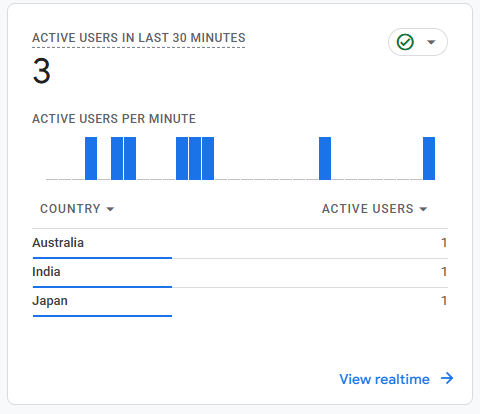

# Google Tag Manager Injector

## Summary

This SharePoint Framework (SPFx) Application Customizer injects **Google Tag Manager (GTM)** into SharePoint Modern pages, enabling analytics and tag management across your tenant. It initializes the standard GTM `dataLayer`, loads the GTM script via `SPComponentLoader`, and hooks into SharePoint's navigation events to track **Single Page Application (SPA) route changes** — ensuring every page view is captured without a full browser reload.

Built to be compliant with the **SharePoint Online Content Security Policy (CSP)** enforcement introduced in March 2026. Because GTM is loaded dynamically at runtime, `https://www.googletagmanager.com` must be manually registered as a **Trusted Script Source** in the SharePoint Admin Center before deployment. See [Prerequisites](#prerequisites) for the required steps.



## Used SharePoint Framework Version


## Applies to

- [SharePoint Framework](https://aka.ms/spfx)
- [Microsoft 365 tenant](https://docs.microsoft.com/sharepoint/dev/spfx/set-up-your-developer-tenant)

> Get your own free development tenant by subscribing to [Microsoft 365 developer program](http://aka.ms/o365devprogram)

## Prerequisites

- Node.js v22.14.0 or compatible version
- A Google Tag Manager account and Container ID (e.g. `GTM-XXXXXXX`)
- Tenant Administrator access to the SharePoint Admin Center

### ⚠️ Required: CSP Trusted Script Source Registration

SharePoint Online enforces [Content Security Policy (CSP)](https://learn.microsoft.com/en-us/sharepoint/dev/spfx/content-securty-policy-trusted-script-sources) on all Modern pages from **March 1, 2026** onwards. This solution uses `SPComponentLoader.loadScript()` to load GTM dynamically at runtime — SharePoint does **not** auto-trust sources loaded this way, so you must register the GTM domain manually.

**Via SharePoint Admin Center:**

1. Go to **SharePoint Admin Center** → **Advanced** → **Script sources**
2. Select **Add source**
3. Enter `https://www.googletagmanager.com` and save

> Wildcard expressions (e.g. `*.googletagmanager.com`) are not supported. Use the exact origin.

**Verify:** Load a Modern page with the solution active and append `?csp=enforce` to the URL. Open DevTools (F12) → Console. No `Content Security Policy` violations means the configuration is correct.


## Solution

| Solution    | Author(s)                                               |
| ----------- | ------------------------------------------------------- |
| js-application-gtm-injector | [@saiiiiiii](https://github.com/saiiiiiii) |

## Version history

| Version | Date          | Comments        |
| ------- | ------------- | --------------- |
| 1.0     | April 2026    | Initial release |

## Disclaimer

**THIS CODE IS PROVIDED _AS IS_ WITHOUT WARRANTY OF ANY KIND, EITHER EXPRESS OR IMPLIED, INCLUDING ANY IMPLIED WARRANTIES OF FITNESS FOR A PARTICULAR PURPOSE, MERCHANTABILITY, OR NON-INFRINGEMENT.**

---

## Minimal Path to Awesome

- Clone this repository
- Update your GTM Container ID in `src/extensions/gtmInjector/GtmInjectorApplicationCustomizer.ts`:
  ```typescript
  const GTM_ID: string = 'GTM-XXXXXXX'; // Replace with your GTM Container ID
  ```
- Ensure that you are at the solution folder
- In the command-line run:
  - `npm install -g @rushstack/heft`
  - `npm install`
  - `heft start`
- Add your SharePoint site URL to `config/serve.json` under `pageUrl`
- Complete the [CSP Trusted Script Source registration](#-required-csp-trusted-script-source-registration) before testing against a CSP-enforced tenant

**To build and package for deployment:**

```bash
heft test --clean --production
heft package-solution --production
```

Upload the generated `.sppkg` from `sharepoint/solution/gtm-tracker.sppkg` to your Tenant App Catalog. The solution is configured with `skipFeatureDeployment: true`, allowing tenant-wide activation directly from the App Catalog.

Other build commands can be listed using `heft --help`.

## Features

This extension injects Google Tag Manager into SharePoint Modern pages and enables full analytics tracking across Single Page Application (SPA) navigations.

This extension illustrates the following concepts:

- Dynamically loading an external analytics script using `SPComponentLoader.loadScript()` in a CSP-compliant manner — avoiding inline scripts which are blocked by SharePoint Online from March 2026 onwards
- Initializing a standard GTM `dataLayer` and pushing the `gtm.js` start event on page load
- Tracking SPA navigations by listening to both SharePoint's `navigatedEvent` (from `this.context.application`) and the browser's native `popstate` event
- Preventing duplicate script injection across component re-renders using a `window.__gtmLoaded` guard flag
- Deploying a tenant-wide Application Customizer with `skipFeatureDeployment: true` for zero-touch rollout

> Notice that better pictures and documentation will increase the sample usage and the value you are providing for others. Thanks for your submissions in advance.

> Share your web part with others through Microsoft 365 Patterns and Practices program to get visibility and exposure. More details on the community, open-source projects and other activities from http://aka.ms/m365pnp.

## References

- [Getting started with SharePoint Framework](https://docs.microsoft.com/sharepoint/dev/spfx/set-up-your-developer-tenant)
- [Support for Content Security Policy (CSP) in SharePoint Online](https://learn.microsoft.com/en-us/sharepoint/dev/spfx/content-securty-policy-trusted-script-sources)
- [SharePoint Online CSP Enforcement Dates and Guidance](https://techcommunity.microsoft.com/blog/spblog/sharepoint-online-content-security-policy-csp-enforcement-dates-and-guidance/4472662)
- [Use Microsoft Graph in your solution](https://docs.microsoft.com/sharepoint/dev/spfx/web-parts/get-started/using-microsoft-graph-apis)
- [Publish SharePoint Framework applications to the Marketplace](https://docs.microsoft.com/sharepoint/dev/spfx/publish-to-marketplace-overview)
- [Microsoft 365 Patterns and Practices](https://aka.ms/m365pnp) - Guidance, tooling, samples and open-source controls for your Microsoft 365 development
- [Google Tag Manager — Developer Quickstart](https://developers.google.com/tag-platform/tag-manager/web)
- [Heft Documentation](https://heft.rushstack.io/)


## Help

If you encounter any issues while using this sample, [create a new issue](https://github.com/saiiiiiii/sp-dev-fx-extensions/samples/js-application-gtm-injector/issues/new).

